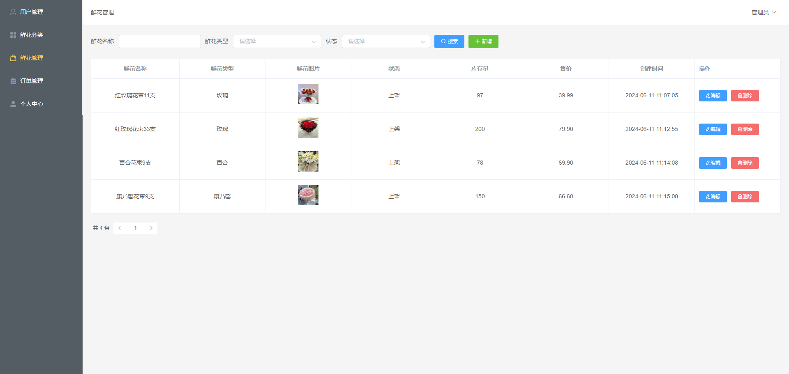
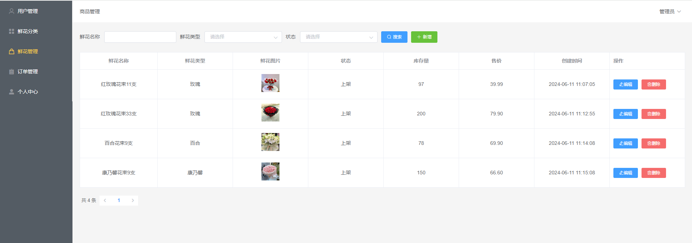
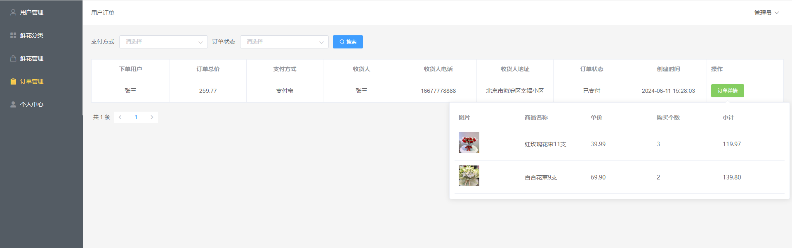
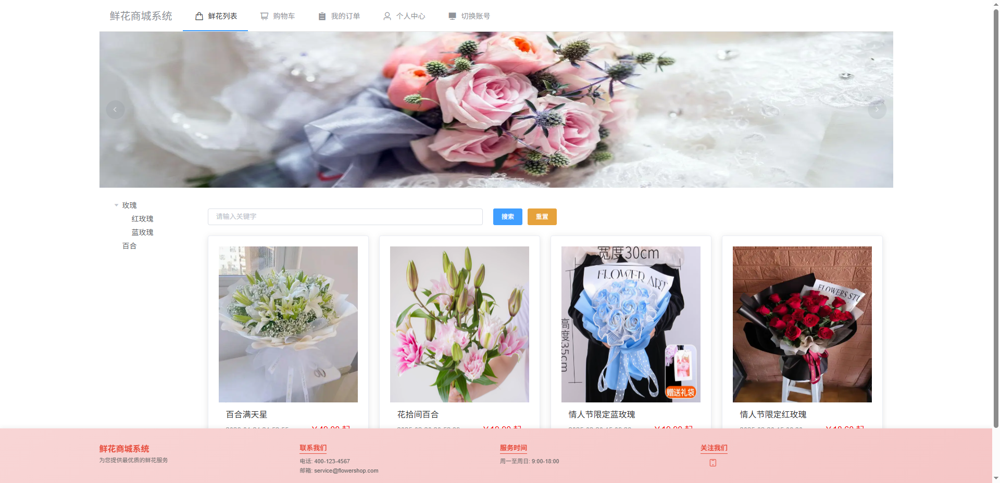
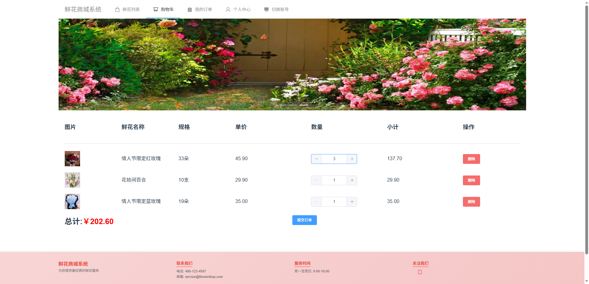
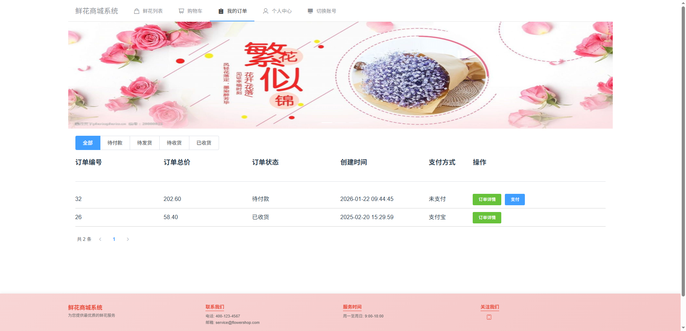
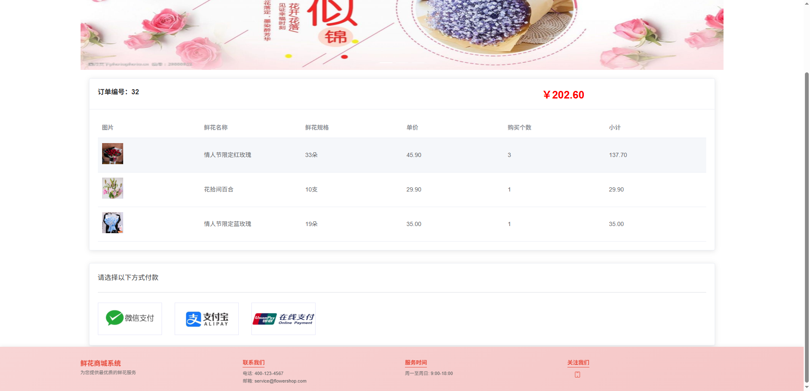
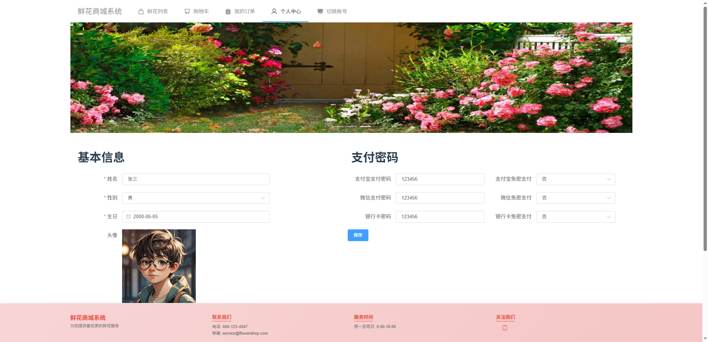
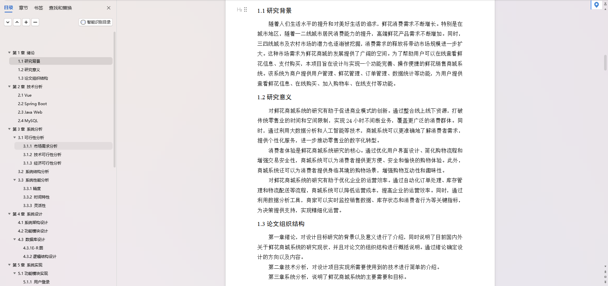
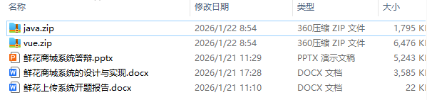

# 项目介绍
计算机毕业设计，鲜花商城系统，SpringBoot+Vue
包含前后端代码、开TI报告模板、答辩ppt、设计文档（查重30%以下）
- 咨询V：bishe688
## 登录注册

## 管理端
- 鲜花信息管理：增删改查鲜花信息
- 鲜花类型管理：增删改查鲜花类型
- 用户信息管理：增删改查用户信息
- 订单管理：查看订单信息、订单详情
- 个人中心：查看和修改个人信息
## 用户端
- 商品列表：查看鲜花分类和鲜花列表
- 商品详情：查看商品详细信息、商品加购
- 购物车：查看购物车商品、提交订单
- 我的订单：查看订单记录、订单详情、订单支付
- 个人中心：查看和修改个人信息、管理收货地址
# 2 系统运行截图
## 2.1 用户登录

## 2.2 鲜花分类

## 2.3 鲜花管理

## 2.4 订单管理

## 2.5 鲜花列表

## 2.6 购物车

## 2.7 我的订单

## 2.8 订单支付

## 2.9 个人中心

# 万字文档

# 文档清单

# 需要源码文档请联系
V：bishe688
