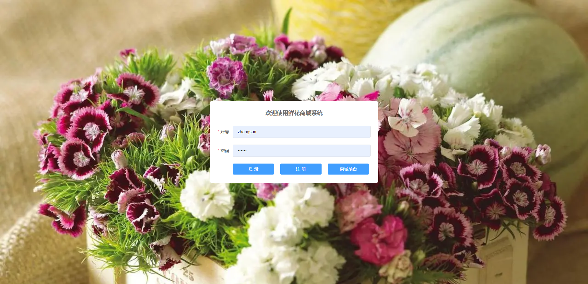
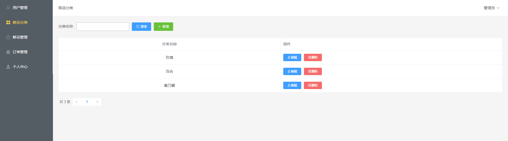
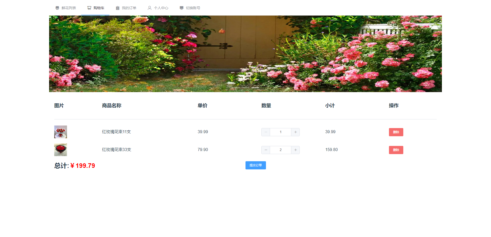
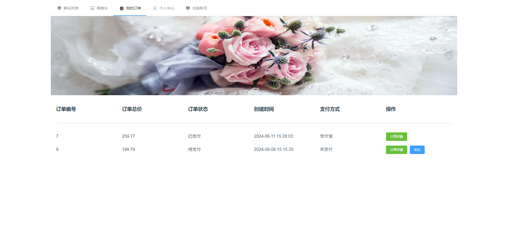
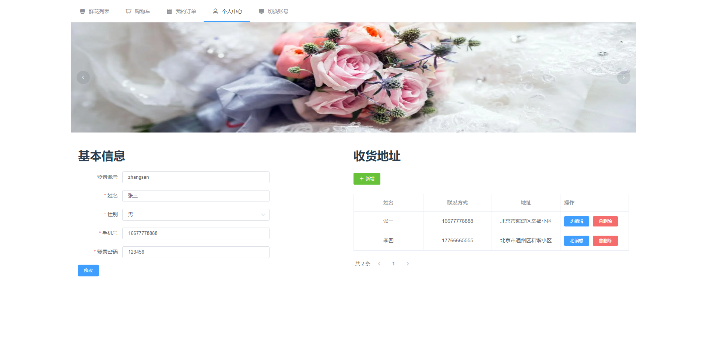

# 1 项目介绍
基于SSM+Vue的鲜花商城系统：后端 SpringBoot、Mybatis-Plus，前端Vue+ElementUI，具体功能如下：
## 管理端
- 鲜花信息管理：增删改查鲜花信息
- 鲜花类型管理：增删改查鲜花类型
- 用户信息管理：增删改查用户信息
- 订单管理：查看订单信息、订单发货
- 个人中心：查看和修改个人信息
## 用户端
- 商品列表：查看鲜花分类和鲜花列表
- 商品详情：查看商品详细信息、商品加购、商品评价
- 购物车：查看购物车商品、提交订单
- 我的订单：查看订单记录、订单详情、订单支付、订单收货
- 个人中心：查看和修改个人信息、管理收货地址
# 2 系统运行截图
## 2.1 用户登录

## 2.2 鲜花管理

## 2.3 订单管理

## 2.4 鲜花列表

## 2.5 鲜花详情

## 2.6 购物车

## 2.7 我的订单

## 2.8 个人中心 

## 2.9 订单支付

# 3 数据库设计

# 4 源码数据库获取(收费)
